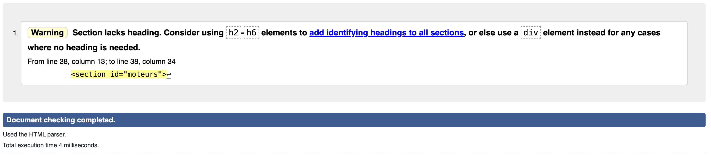
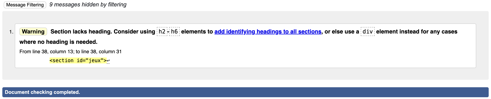
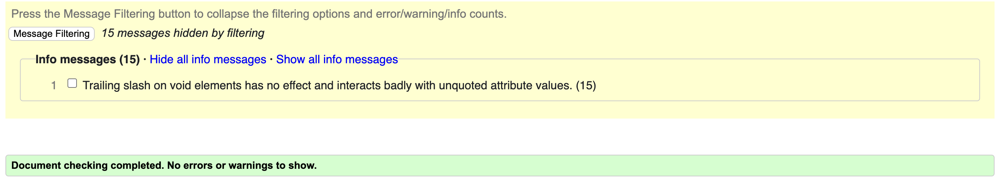

# SAE 105
---
## Table des matières
* [Element visuel du site](#visuel)
* [Membres du groupe](#membre)
* [Justification du nom du projet, objectifs du site](#justification)
* [Motivation pour le sujet](#motivation)
* [Lien du site web](#lien)
* [Description de chaque page créée et de son fonctionnement, les langages utilisés, l'auteur etc](#description)
* [Fichier Json avec les explications et la justification de sa structuration](#json)
* [Arborescence du site](#arborescence)
* [Favicon](#favicon)
* [La police](#reference)
* [Validation W3C](#w3c)
* [Contraintes de la SAE](#contraintes)
* [Autoévaluation](#autoevaluation)
    * [Tâches que chacun à effectué](#taches)
    * [Ratio de travail](#pourcentage)
* [Autoévaluation pour le groupe](#groupe)
* [Inspiration](#inspiration)

## Elément visuel représentatif du site 
**Turi-Blog**

## Membres du groupe 
>Résponsable des rendus :
>Rémy ESLINGER MM1-TD2-TP3 remy.eslinger2@etu.univ-lorraine.fr 

>Guewen DEUTSCH MM1-TD2-TP3 guewen.deutsch8@etu.univ-lorraine.fr

## Justification du nom du projet, objectifs du site 
Le site est un blog sur le thème des moteurs de jeu ainsi que sur les jeux produits par ces derniers.

## Motivation pour le sujet 
Notre idée nous est venu grace à :

A nous deux, il y a pas longtemps on c'était intéressé au dévelopement de jeux vidéos et on s'est dit que c'était un bon thème à aborder pour cette SAE105.

## Lien du site web 
l'URL du site hébergé sur webetu :
[https://webetu.iutnc.univ-lorraine.fr/~e96347u/sae105-moteurdejeu](https://webetu.iutnc.univ-lorraine.fr/~e96347u/sae105-moteurdejeu)

## Description de chaque page créée et de son fonctionnement, les langages utilisés, l'auteur etc 
1. Elements communs :
La base de la feuille de style CSS a été faite par Rémy.
Chaque page possède une barre de navigation `<nav>` en haut de la page et un pied de page `<footer>`.
La barre de navigation a été faite par Rémy et le footer par Guewen.
Chaque page a également été pensée avec la même structure pour une meilleur organisation du code et de la page : 
    * Un en-tête `<header>`
    * Le contenu principal `<main>`
    * Un pied de page `<footer>`

2. Page d'accueil :
La page d'accueil a été faite en HTML et CSS uniquement.
Le panneau de présentation du site a été fait par Rémy.
L'accueil possède un carrousel qui fonctionne grace a une animation en CSS avec la règle `@keyframes` qui décrit les états des différentes étapes intermédiaires de l'animation CSS.

3. Page de formulaire de contact :
La page de contact a été faite par Guewen, la page est faite en HTML et CSS mais n'est pas encore utilisable car il manque la partie PHP pour l'envoye du mail.
La page de contact est faite a partir des balises `input` et `textarea`, on a utiliser les attributs `type` et `required` afin de filtrer les informations entré dans les zones de texte.

4. Page des moteurs :
La page des moteurs de jeu a été faite par Rémy, en HTML et CSS pour la version statique et avec du JavaScript pour dynamiser la page. Dans le HTML, on a utiliser des balises spécifique pour une meilleur sémentique, tel que `section` qui représente un groupe de contenu thématique ou encore `article` qui est une balise souvant utiliser dans des blogs ou des journaux en ligne, la balise représente des éléments qui peuvent être réutilisée de manière indépendante.

5. Page des jeux :
La page des jeux a été faite par Guewen en utilisant les même language et la même sémentique que la page des moteurs pour garder une cohérence sur l'ensemble du site.

## Fichier Json 

[Fichier JSON Moteur par Rémy](../medias/json/moteur.json)

J'ai commencer par faire une liste de moteurs avec plusieur clé pour chaque "moteur": 
- nom : `string`
- entreprise : `string`
- tarifs : `string`
- opensource (Si c'est Open Source ou pas) : `bool`
- description : `string`
- langageDeProg : (Langage de programation utilise ou système de programmation) : `string`
- avantages : `liste`
    - nom : `string`
    - description : `string`
- avantages : `liste`
    - nom : `string`
    - description : `string`
- desavantages : `liste`
    - nom : `string`
    - description : `string`
- jeux : `liste`
    - nom : `string`
    - description : `string`
- versions : `liste`
    - nom : `string`
    - description : `string`

[Fichier JSON jeux.json](../medias/json/jeux.json)

- imageJeu `string`
- nomJeu : `string`
- moteur : `string`
- prix : `string`
- plateforme : `liste`
    - `string`
- avisUtilisateur : `liste`
    - nomSite : `string`
    - noteSite : `string`
- tag : `liste`
    - `string`

- description : `string`
- developpeur : `string`
- editeur : `string`
- dlc : `bool`
- langue : `liste`
    - nom : `string`
    - interface : `bool`
    - audio : `bool`
    - soustitres : `bool`

## Arborescence du site 

Il y a 4 pages au total : 

- Accueil (L'index)
- Les moteurs (Listes des moteurs avec le Json)
- Les jeux (Listes des jeux avec le Json)
- Nous contacter (Une page pour nous contacter avec un formulaire)

## Favicon 

Sachant qu'on n'a pas d'identité propre (pas de nom, ni de logo), on choisit d'être simple et on mis `M` en tant que favicon : 

## La police 

La police qu'on a choisis est la [Narkiss Yair Variable](https://fonts.adobe.com/fonts/narkiss-yair-variable)

## Validation W3C 

Il y un warning mais c'est juste l'emplacement où le JS est injecter.

Il y un warning mais c'est juste l'emplacement où le JS est injecter.

## Contraintes de la SAE 

* **Générales :**

    [x] Utiliser les langages web : HTML, CSS, JS.

    [x] Les codes (html, css, js) devront être écrits selon les règles et convention en vigueur, correctement indentés et précisément commentés.

    [x] Vous devrez utiliser le logiciel d'édition de code VSCode avec les extensions utilisées jusqu'ici.

    [x] Le site (par son thème, ses données, ses contenus médias ou textuels...) ne devra contenir aucune connotation ou interprétation politique, religieuse, sexuelle etc.

    [x] La récupération/adaptation d'un code existant est interdite.

    [x] A priori, les techniques utilisées sont restreintes à ce qui a été abordé dans les ressources associées à la SAE.

    [x] Le nom du dossier principal du dite doit être le nom du projet

    [x] Respectez dès le départ l'arborescence des dossiers demandée.

* **Intégration :**

    [x] Votre workspace (espace de travail) vscode sera nommé sae105

    [x] La page principale du site doit être nommée index.html

    [x] Le site devra être de largeur fixe

    [x] Les fichiers seront organisés en dossiers, conformément aux préconisations d'arborescence faites en cours IntegWeb (classement des fichiers selon leur type ou fonctions).

    [x] Les pages créées doivent être valides W3C.

    [] Les pages créées (statiques et dynamiques) devront être signées avec le nom de l'étudiant qui en est l'auteur dans le footer

    [x] Les éléments d'intégration en faveur de l'accessibilité devront être utilisés partout où cela est possible (images avec alt, liens avec title, formulaires avec labels...)

    [x] Une barre de navigation devra être présente sur toutes les pages pour accéder aux différente parties du site

    [x] Sur l'ensemble du site, vous devrez avoir intégré un maximum d'éléments sémantiques abordés en intégration : titres, paragraphes, médias, listes, tableaux, formulaire etc.

    [] Les médias intégrés pourront être tirés d'internet mais devront être libres de droit

    [x] Le formulaire devra contrôler le bon type de champs (selon données saisies), le caractère obligatoire ou non de la saisi et permettre de naviguer dans les champs du formulaire par la clavier

    [x] Les médias devront être optimisés pour une diffusion sur le web (format, taille, niveau de compression...). Le format webp est à priviléger.

    [x] La mise en forme des contenus sera effectuée par des feuilles de styles CSS externes.

    [x] Vous devrez développer vos propres fichiers CSS, il est interdit d'utiliser une plateforme html/css ou un modèle existant

    [x] Il faut démontrer votre bonne connaissance de tous les sélecteurs CSS abordés en R111.

    [x] Les codes HTML et CSS devront être commentés "intelligemment".

    [x] Le code CSS devra exploiter au mieux tous les mécanismes vus dans le module IntegWeb (classes générales, spécifiques, conditionnelles, partagées, sélecteurs avancés, pseudo-classes, pseudo-éléments...)

    [x] Les images devront être intégrées soit en html soit via css selon qu'elles sont sémantiques ou uniquement décoratives.

    [] Il faudra être très attentifs aux poids (format, taille, taux de compression...) des images intégrées.

    [x] Votre site devra utiliser au moins une police hébergée en ligne

    [x] Votre site devra intégrer une favicon personalisée

* **Développement web :**

    [x] Les données manipulées par le site doivent être structurées en JSON et sont de taille significative. 

    [x] Chaque étudiant produit au moins une page dynamique dans le site. Il faut donc au moins un fichier JSON par étudiant.

    [x] Chaque page dynamique devra être générée en parcourant et sélectionnant des éléments dans le fichier json (imbrication de boucles et de conditionnelles).

    [x] Les 2 fichiers JSON ne devront pas avoir la même structure et déboucheront donc sur des scripts JS différents.

* **Hébergement :**

    [x] Votre site devra être hébergé sur l'espace personnel (webetu) de chaque membre du groupe.

    [x] Le site devra avoir été mis en ligne via l'extension SFTP intégrée à vscode tel que cela a été fait en tp d'intégration web.

    [x] Chaque étudiant devra avoir individuellement mis en place un fichier .htaccess à la racine de son projet de SAE.
    

## Autoévaluation 

### Tâches que chacun à effectué 

On a fait chacun notre JavaScript et JSON, concernant le HTML, au départ on a réparti la page moteur pour moi (Rémy) et la page Jeux pour Guewen. Puis la page d'accueil et la page de contact, on les a faites ensemble. Concernant l'hébergement, on à fait le README ensemble et j'ai fait le .htaccess et les erreurs 403 et 404.

### Ratio de travail 

Nous avons un ratio assez équilibré, donc un près dans les eaux de 50% chacun. On n'arrive pas trop à estimer sachant qu'on a souvent réutilisé le code de chacun et même travaillé des fois sur les pages HTML de chacun pour corriger des erreurs et avoir un avis supplémentaire.

## Autoévaluation pour le groupe 

On pense que dans l'ensemble on pourrait atteindre 16/20.

## Inspiration 

On s'est dit, vu que notre projet est autour des moteurs de jeux, pourquoi pas un blog avec chaque spécificité de chacun d'entre eux. Donc on s'est inspiré de comment sont faits les blogs et remanié à notre manière.
